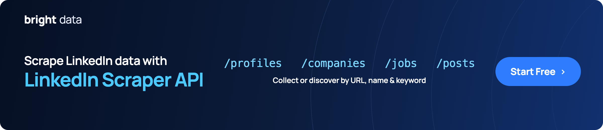

[](https://brightdata.com/products/web-scraper/linkedin?utm_source=github)

# linkedin-scraper-node

[](https://github.com/brightdata/linkedin-scraper-node/actions/workflows/live.yml)
[](https://github.com/brightdata/linkedin-scraper-node/actions/workflows/live.yml) <!-- verified: rewritten by the daily run -->

[Quickstart](#quickstart) · [Command](#or-run-it-as-a-command) · [Endpoints](#the-rest-of-the-api) · [Data](#the-data) · [Errors](#when-it-fails) · [Coding agents](#coding-agents) · [Docs](https://docs.brightdata.com/products/scrapers/linkedin/introduction) · [Support](#support)

LinkedIn profiles, companies, jobs and posts as JSON, in JavaScript. No LinkedIn
login, no browser. Built on the
[Bright Data LinkedIn Scraper API](https://brightdata.com/products/web-scraper/linkedin?utm_source=github).

Uses the [Bright Data JavaScript SDK](https://github.com/brightdata/sdk-js).
Full API docs:
[LinkedIn Scraper API](https://docs.brightdata.com/products/scrapers/linkedin/introduction).

Also here: a one-command CLI for profiles, and the
[Bright Data CLI](#coding-agents), which needs no JavaScript at all.

LinkedIn profile data is personal data. Use it within the law that applies to
you: [Bright Data compliance](https://brightdata.com/legal-governance).

## Quickstart

Node 20 or newer. This package is ESM, so use `import`, not `require`.

```bash
npm install @brightdata/sdk
export BRIGHTDATA_API_TOKEN=YOUR_API_KEY
```

Get a token from the
[Bright Data control panel](https://brightdata.com/cp/setting/users). This SDK
does not read a `.env` file; Node loads one for it with
`node --env-file=.env yourscript.mjs`.

Or skip the token. Run `npx -p @brightdata/cli bdata login` once: it opens a
browser, and from then on the SDK finds the stored credentials on its own, for
you and for any coding agent working in that terminal. Agents cannot click
through the login, so do it yourself first.

No account yet? [Create one](https://brightdata.com/cp/start); new accounts get
[5,000 free credits a month](https://docs.brightdata.com/general/account/billing-and-pricing/free-tier).

```javascript
import { bdclient } from "@brightdata/sdk";

const client = new bdclient({ autoCreateZones: false });
const job = await client.scrape.linkedin.collectProfiles(
  ["https://www.linkedin.com/in/satyanadella/"],
  { async: true, includeErrors: true },
);
const result = await job.toResult({ pollTimeout: 600_000 });
if (!result.success) throw new Error(`${result.status}: ${result.error}`);
const [profile] = result.data;
console.log(profile.name, "|", profile.position);
console.log(profile.followers, "followers,", profile.connections, "connections");
await client.close();
```

```
Satya Nadella | Chairman and CEO at Microsoft
12172205 followers, 500 connections
```

Expect one to three minutes: the API runs a job and `toResult` waits for it.
One [credit](https://brightdata.com/pricing/web-scraper) per profile.

Three things in that snippet are not optional.

`autoCreateZones: false` stops the SDK creating zones on startup. The zones are
for Web Unlocker and SERP, two other Bright Data products this scraper never
touches. Creating one fails on accounts without a payment method.

`includeErrors: true` makes the API report a dead profile as a row. Without it
the row is dropped and you get nothing.

`async: true` is what makes `collectProfiles` hand back a job rather than going
through the synchronous endpoint, which gives up after a minute.

`pollTimeout` is milliseconds, not seconds. A number copied from a Python
example expires before the first status check.

## Or run it as a command

The command in this repo does the same for several profiles and writes one
JSON file.

```bash
npm install -g github:brightdata/linkedin-scraper-node
linkedin-scraper satyanadella reidhoffman
```

While this repository is private, that install line works only for people with
access to it.

```
Fetching 2 LinkedIn profiles: satyanadella, reidhoffman
One job for all of them, usually one to three minutes. One credit per profile.
asking  2 profiles...
got     satyanadella: 34 fields (Satya Nadella)
got     reidhoffman: 38 fields (Reid Hoffman)

Saved 2 of 2 profiles as JSON to linkedin.json
```

It takes a profile URL just as happily as the slug inside it, so
`linkedin-scraper https://www.linkedin.com/in/satyanadella/` does the same
thing.

In a terminal the `asking` line is replaced by this, updating in place, so you
can see it is working and how long it has been going:

```
⠹ 2 profiles 0:01:12
```

```
--out PATH   output file, default linkedin.json
```

Every profile you ask for goes into one job. The API bills per record, not per
job, and a job takes one to three minutes whether it carries one URL or ten, so
ten profiles cost the same wait as one.

Import it instead of running it, for `ok` and `error` per profile instead of raw
rows. `scrape` never rejects for one bad profile; check `ok` before reading
`profile`:

```javascript
import { scrape } from "@brightdata/linkedin-scraper-node";

for (const outcome of await scrape(["satyanadella", "zz-not-a-real-profile-zz"])) {
  if (outcome.ok) {
    console.log(`${outcome.slug}: ${outcome.profile.name}`);
  } else {
    console.log(`${outcome.slug} failed: ${outcome.error}`);
  }
}
```

```
satyanadella: Satya Nadella
zz-not-a-real-profile-zz failed: The profile is hidden or private.
```

## The rest of the API

The command covers the first row of the table below. The rest of the SDK's
LinkedIn surface is the other rows, documented in the
[LinkedIn Scraper API docs](https://docs.brightdata.com/products/scrapers/linkedin/introduction).
Every snippet below is complete and needs only `@brightdata/sdk`: paste it as
is. Every one of them runs in Actions each Monday, a smaller check runs every
other day, and the badge at the top is the latest result.

| you have | want | call |
| --- | --- | --- |
| a profile URL | that profile | `collectProfiles([url], { async: true, includeErrors: true })` |
| a first and last name | matching profiles | `discoverProfiles([{ first_name, last_name }], …)`, see the note below |
| a company URL | that company | `collectCompanies([url], { async: true, includeErrors: true })` |
| a job URL | that job posting | `collectJobs([url], { async: true, includeErrors: true })` |
| a keyword and a location | matching job postings | `discoverJobs([{ location, keyword }], …)` |
| a post URL | that post | `collectPosts([url], { async: true, includeErrors: true })` |
| a profile URL | that person's posts | `discoverUserPosts([{ url }], …)` |
| a company URL | that company's posts | `discoverCompanyPosts([{ url }], …)` |

All of them hang off `client.scrape.linkedin`.

`discoverProfiles` takes `{ first_name, last_name }`, not a URL. It is people
search by name. This README documents that it exists and does not demonstrate
it against a real person.

There is no example here built on a pinned job URL. A posting closes, and a
snippet pinned to it would turn red the week that happened. Discover jobs by
keyword and location instead, as the table shows.

Every one of these is an asynchronous job. The API triggers it, the SDK polls,
and the call returns when it is ready. That is why a call takes one to three
minutes. The API's
[synchronous endpoint](https://docs.brightdata.com/api-reference/scrapers/synchronous-requests),
20 URLs and a one-minute limit, is raw HTTP only.

The four short names, `profiles`, `companies`, `jobs` and `posts`, trigger, poll
and fetch in one call and hand back a `ScrapeResult`. The `collect` and
`discover` names hand back a `ScrapeJob` you poll yourself. Only that second
group can pass `includeErrors`. A run that must tell a dead profile from an
empty one uses it.

### Several profiles, one job

An array of URLs is one job, not one per profile.

```javascript
import { bdclient } from "@brightdata/sdk";

const client = new bdclient({ autoCreateZones: false });
const job = await client.scrape.linkedin.collectProfiles(
  [
    "https://www.linkedin.com/in/satyanadella/",
    "https://www.linkedin.com/in/reidhoffman/",
  ],
  { async: true, includeErrors: true },
);
const result = await job.toResult({ pollTimeout: 600_000 });
if (!result.success) throw new Error(`${result.status}: ${result.error}`);
for (const profile of result.data) {
  console.log(profile.name, "|", profile.city ?? "no city", "|", profile.followers, "followers");
}
await client.close();
```

```
Reid Hoffman | United States | 2792708 followers
Satya Nadella | Redmond, Washington, United States | 12172206 followers
```

Rows come back in no guaranteed order. Match them to what you asked for with
`input_url`, not by position.

### Trigger now, fetch later

For anything bigger than a few profiles, do not block a process for an hour.
Trigger, keep the snapshot id, fetch when ready. Snapshots stay downloadable
for 30 days.

```javascript
import { bdclient } from "@brightdata/sdk";

const client = new bdclient({ autoCreateZones: false });
const job = await client.scrape.linkedin.collectProfiles(
  ["https://www.linkedin.com/in/satyanadella/"],
  { async: true, includeErrors: true },
);
console.log("snapshot:", job.snapshotId);
await job.wait({ pollInterval: 5_000, pollTimeout: 600_000 });
console.log("status:", await job.status());
const [record] = await job.fetch();
console.log("fetched:", record.name, "|", record.current_company_name);
await client.close();
```

```
snapshot: sd_mu52fz8odk79uf5we
status: ready
fetched: Satya Nadella | Microsoft
```

A `ScrapeJob` also has `download()` to write the snapshot to disk and `cancel()`
to stop it.

### A company

```javascript
import { bdclient } from "@brightdata/sdk";

const client = new bdclient({ autoCreateZones: false });
const job = await client.scrape.linkedin.collectCompanies(
  ["https://www.linkedin.com/company/bright-data/"],
  { async: true, includeErrors: true },
);
const result = await job.toResult({ pollTimeout: 600_000 });
if (!result.success) throw new Error(`${result.status}: ${result.error}`);
const [company] = result.data;
console.log(company.name, "|", company.employees_in_linkedin, "employees on LinkedIn");
await client.close();
```

```
Bright Data | 407 employees on LinkedIn
```

### Jobs by keyword and location

`location` is required. `keyword`, `company`, `time_range`, `job_type`,
`experience_level` and `remote` are optional.

```javascript
import { bdclient } from "@brightdata/sdk";

const client = new bdclient({ autoCreateZones: false });
const job = await client.scrape.linkedin.discoverJobs(
  [{ location: "London", keyword: "data engineer", time_range: "Past week" }],
  { async: true, includeErrors: true, limitPerInput: 5 },
);
const result = await job.toResult({ pollTimeout: 900_000 });
if (!result.success) throw new Error(`${result.status}: ${result.error}`);
for (const posting of result.data.slice(0, 3)) {
  console.log(posting.job_title, "|", posting.company_name, "|", posting.job_location);
}
await client.close();
```

```
Data Engineer | FDJ UNITED | London Area, United Kingdom
Senior Data Engineer | Firstup | London, England, United Kingdom
Data Engineer | General Atlantic | London Area, United Kingdom
```

Job discovery bills one credit per row, and a broad filter matches thousands of
postings. `limitPerInput` caps it. The call above returned exactly 5.

Pass `async: true` alongside it. Without that key the option is stripped before
the request, with no error, and the job runs uncapped
([sdk-js#36](https://github.com/brightdata/sdk-js/issues/36)). The SDK's
`DiscoverOptions` type says to omit `async`, so the typed call is the one that
costs you.

## The data

The fields most people want from a profile:

```
name  position  city  current_company_name  followers  connections  experience
```

The code hardcodes no field list. Whatever the API returns lands in
`result.data`, and in the command's file.

The API marks 8 of these fields as personal data, with `pii: true` in the
schema: `id`, `name`, `about`, `url`, `input_url`, `linkedin_id`, `first_name`
and `last_name`. Read that flag rather than keeping your own list.

<!-- fields:start -->
<details>
<summary>All 47 fields, with type and description</summary>

Regenerated every day from the dataset schema, via
`client.datasets.linkedinProfiles.getMetadata()`, so it cannot go stale. A
profile carries the fields that apply to it: the sample file has 32
of these 47, plus `timestamp` and `input`,
which the schema does not list.

| field | type | description |
| --- | --- | --- |
| `id` | text | Personal data. A unique identifier for the person's LinkedIn profile |
| `name` | text | Personal data. Profile name |
| `city` | text | Geographical location of the user |
| `country_code` | text | Geographical location of the user |
| `position` | text | The current job title or position of the profile |
| `about` | text | Personal data. A concise profile summary. In some cases, only a truncated version with "…" is displayed on the website, and this is the version we capture |
| `posts` | array | Contains information related to the user's last LinkedIn posts. It typically includes the post title, created date, URL link to the post, etc. |
| `groups` | array | The LinkedIn groups that the profile is a part of |
| `current_company` | object | Provides information about the user's current professional position. It typically includes the company name, the user's job title, the company ID, and the industry or sector to which the company belongs |
| `experience` | array | Contains information about user's professional history. It typically includes the user's job title, length of time the user held the position, the geographic location of the company, the start and end date, the company name, URL link to the company profile, etc. |
| `url` | url | Personal data. URL that link directly to the LinkedIn profile |
| `people_also_viewed` | array | Provides a list of LinkedIn profiles that users who have viewed the user's profile, have viewed these as well |
| `educations_details` | text | Provides information about the user's educational background |
| `education` | array | Provides information about the user's educational background. It typically includes the degree, the start and end year, the filed, etc. |
| `recommendations_count` | number | A numeric count of the total number of recommendations that the user has received |
| `avatar` | url | URL that link to the profile picture of the LinkedIn user |
| `courses` | array | Contains information about courses or educational programs that the user has undertaken |
| `languages` | array | Contains information about the user's proficiency in different languages |
| `certifications` | array | Licenses & Certifications |
| `recommendations` | array | Recommendations that the user has received from their connections or colleagues on LinkedIn |
| `volunteer_experience` | array | Contains information related to the user's volunteer work |
| `followers` | number | How many users/ companies following the profile |
| `connections` | number | How many connections the profile has |
| `current_company_company_id` | text | The id of the latest/current company of the profile |
| `current_company_name` | text | The name of the latest/current company of the profile |
| `publications` | array | Published works or presentations |
| `patents` | array | Patents filed or granted |
| `projects` | array | Professional or academic projects |
| `organizations` | array | Memberships in professional organizations |
| `location` | text | Geographical location of the user |
| `input_url` | url | Personal data. The URL that was entered when starting the scraping process |
| `linkedin_id` | text | Personal data. LinkedIn profile identifier |
| `activity` | array | Any activity the user has regarding posts |
| `linkedin_num_id` | text | Numeric LinkedIn profile ID |
| `banner_image` | url | Banner image |
| `honors_and_awards` | array | Awards and recognitions received |
| `similar_profiles` | array | Profiles similar to the current one |
| `default_avatar` | boolean | Is the avatar picture the default avatar empty picture |
| `memorialized_account` | boolean | Boolean indicating if the account is memorialized |
| `bio_links` | array | External links added to the bio |
| `first_name` | text | Personal data. First name of the user |
| `last_name` | text | Personal data. Last name of the user |
| `urn_id` | text | The Uniform Resource Name (URN) used by LinkedIn |
| `urn` | text | Uniform Resource Name |
| `influencer` | boolean | Indicator if the profile marked as influencer |
| `fsd_profile_id` | text | FSD profile ID |
| `backfilled_columns` | object | Indicates whether sticky columns were backfilled. Keys are column names and values are true/false. |

</details>
<!-- fields:end -->

<details>
<summary>The start of a real output file, from <code>linkedin-scraper satyanadella</code></summary>

```json
{
  "generated_at": "2026-09-17T05:07:02.996Z",
  "profiles": [
    {
      "slug": "satyanadella",
      "profile": {
        "id": "satyanadella",
        "name": "Satya Nadella",
        "city": "Redmond, Washington, United States",
        "country_code": "US",
        "position": "Chairman and CEO at Microsoft",
        "about": "As chairman and CEO of Microsoft, I define my mission and that of my company as empowering every person and every organization on the planet to achieve more.",
        "posts": [
          {
            "title": "How do we build a frontier intelligence ecosystem?",
            "attribution": "Great to be back at Microsoft Build today. For us, it is not about any one piece of technology or even the platform.",
            "img": "https://media.licdn.com/dms/image/v2/D5612AQEiPOCznzusVw/article-cover_image-shrink_720_1280/B56ZnaEmAPHAAI-/0/1760300263776?e=2147483647&v=beta&t=wFogtGsELbNXfbXZIw37bNUzyYGF8CNcMpj-BMIKqpI",
            "link": "https://www.linkedin.com/pulse/how-do-we-build-frontier-intelligence-ecosystem-satya-nadella-73jhc",
            "created_at": "2026-06-02T00:00:00.000Z",
  ...
```

The whole file, one profile with every field, is
[examples/sample_output.json](examples/sample_output.json).

</details>

## When it fails

| you see | what it means |
| --- | --- |
| `API token required but not found.` | Exit 2, before any request. Set the token. |
| `failed  slug: ...` | Exit 1. No such profile, usually a typo in the slug. |
| `failed  slug: the API returned no row for this profile` | Exit 1. The job came back without a row for that input. Run it again. |
| `failed  slug: Polling timed out after 605s for sd_...` | Exit 1. A request gives up after 600 seconds. A slow hour at the API does this. Run it again. |

Any failure exits 1, so a run is safe to gate a script on.

From the SDK, the same conditions look like this:

| you see | what it means |
| --- | --- |
| `AuthenticationError: No API token found.` | No token anywhere: not in the options, the environment, or the CLI login. |
| `APIError` with status 401 | The token is set but wrong. |
| `result.success` is `false`, `result.status` is `"timeout"` | The SDK gave up waiting. Raise `pollTimeout`, in milliseconds, or run it again. |
| a row in `result.data` with an `error` key | The API's answer for one input, when you asked for `includeErrors`. The other rows are fine. |
| zero rows where you expected an error | You did not pass `includeErrors: true`, so the API dropped the row that would have explained it. |

## Coding agents

No JavaScript, nothing installed. Paste both lines; the first opens a browser
once, or use `bdata login --device` over SSH and in CI:

```bash
npx -p @brightdata/cli bdata login
npx -p @brightdata/cli bdata pipelines linkedin_person_profile "https://www.linkedin.com/in/satyanadella/"
```

`bdata pipelines list` prints every type. The LinkedIn ones are
`linkedin_person_profile`, `linkedin_company_profile`, `linkedin_job_listings`,
`linkedin_posts` and `linkedin_people_search`. Each takes URLs, prints JSON,
and costs one credit per record.

`npx skills add brightdata/skills` teaches Claude Code, Cursor and Codex these
commands and the docs, so plain language works afterwards. Full guide:
[Bright Data for your coding agent](https://docs.brightdata.com/quickstart-coding-agent).

No terminal, for a hosted assistant? The
[Bright Data MCP server](https://github.com/brightdata/brightdata-mcp#which-tool-to-use)
has LinkedIn tools in its `social` group, which is off unless you ask for it:

    https://mcp.brightdata.com/mcp?token=YOUR_API_TOKEN&groups=social

An agent can also open the account itself, no signup form:
[agent registration](https://brightdata.com/auth.md). Everything else Bright
Data connects to, from LangChain to Zapier and n8n:
[integrations](https://docs.brightdata.com/integrations/introduction).

## Support

Bugs in this repo:
[open an issue](https://github.com/brightdata/linkedin-scraper-node/issues).
Anything about the API, your account or your credits:
[Bright Data support](https://brightdata.zendesk.com/hc/en-us/requests/new).

## License

MIT.
